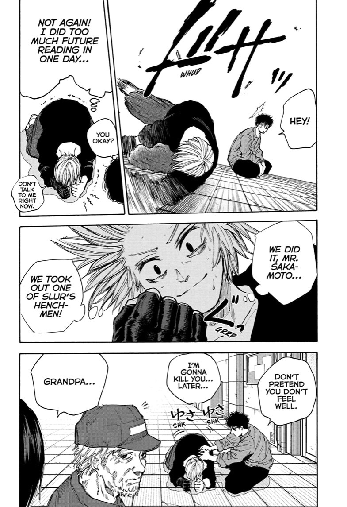

Scrambles images based on keys you provide. The same keys can be used by a third party to reconstruct the image. 
 

 
## Demo  

<table style="padding:10px">
  <tr>
    <td> 
         
    </td>  
    <td>
        
    </td>
   <td>
        
    </td>
  </tr>
</table>
